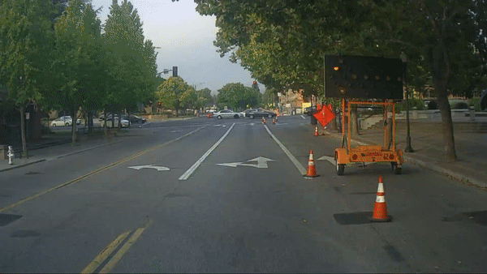
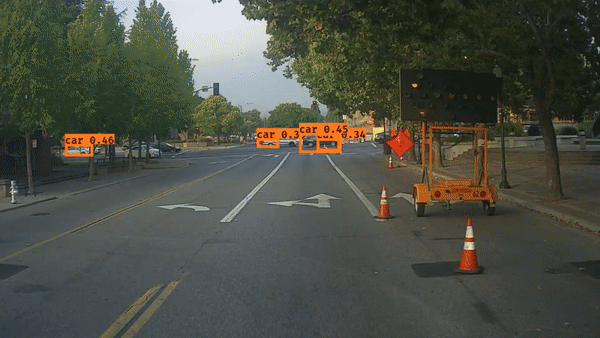

# YOLO: Car detection for autonomous driving

We discover how the [YOLO (You Look Only Once)](https://pjreddie.com/darknet/yolo/) algorithm performs object detection, and then apply it to car detection, a critical component of a self-driving car. Because the YOLO model is very computationally expensive to train, the pre-trained weights are already loaded for you to use.

## Dataset
We have 120 images collected by a camera mounted to the hood (meaning the front) of a car that takes pictures of the road ahead every few seconds as you drive around. The video below shows pictures taken from a car-mounted camera while driving around Silicon Valley (dataset provided by <a href="https://www.drive.ai/">drive.ai</a>).

## YOLO encoding architecture
YOLO is a popular algorithm because it achieves high accuracy while also being able to run in real time. This algorithm "only looks once" at the image in the sense that it requires only one forward propagation pass through the network to make predictions. After non-max suppression, it  outputs recognized objects together with the bounding boxes. The detailed architecture for encoding the input image and the detection results are as shown below:

## Object detection

The video below shows the bounding boxes of the objects detected from the pictures shown above by the YOLO model. The boxes are labeled with the class name and the probability (i.e. confidence) of the detected object.

